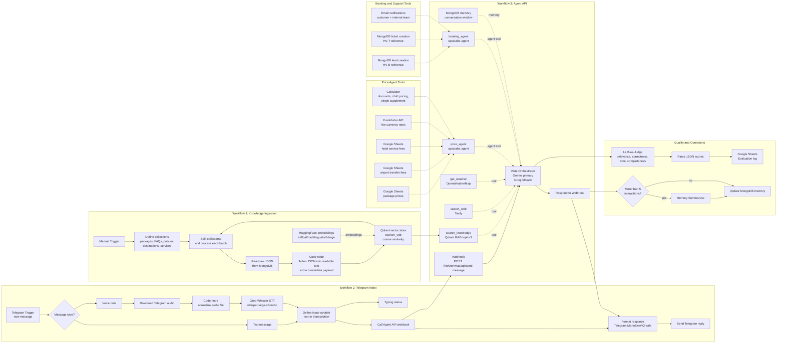

# HorizonVista AI Travel Consultant - n8n Flowchart

This diagram focuses on the actual n8n processes used in the project: knowledge ingestion, Telegram inbox handling, Agent API orchestration, live pricing, booking/ticketing, memory, and response evaluation.

## Process Summary

| Process | n8n workflow | Business purpose |
|---|---|---|
| Knowledge ingestion | `Embedding feeding.json` | Turns tourism content from MongoDB into searchable multilingual vectors in Qdrant. |
| Customer channel handling | `Telegram inbox message processing.json` | Accepts Telegram text and voice, transcribes voice notes, calls the agent API, and sends clean replies. |
| Agent orchestration | `AGENT API setup.json` | Runs Vista, the main AI consultant, and coordinates RAG, web search, weather, pricing, booking, memory, and evaluation. |
| Pricing | Agent API sub-agent | Keeps prices live in Google Sheets so staff can update them without redeploying or re-embedding data. |
| Booking and complaints | Agent API sub-agent | Captures booking leads and support tickets in MongoDB, sends email confirmations, and returns reference numbers. |
| Memory | Agent API | Preserves user context with MongoDB chat memory and summarizes after longer conversations. |
| Evaluation | Agent API branch | Scores every response with an LLM-as-Judge rubric and logs results to Google Sheets for monitoring. |

## Key Design Logic

- Static knowledge is embedded into Qdrant; volatile pricing is kept outside the vector database.
- The Orchestrator is the only customer-facing agent; specialist agents handle pricing and transactions behind the scenes.
- Telegram voice notes become normal text through Whisper STT before entering the same Agent API path.
- Every conversation can be evaluated automatically, giving the project a measurable quality loop.
- MongoDB is used across the system for knowledge, memory, leads, and support tickets.
